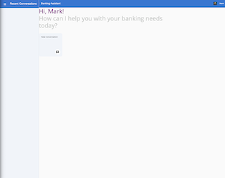
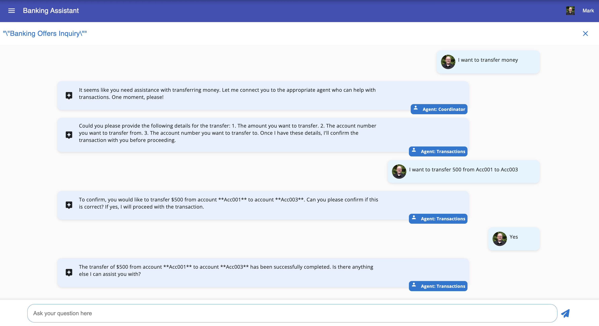
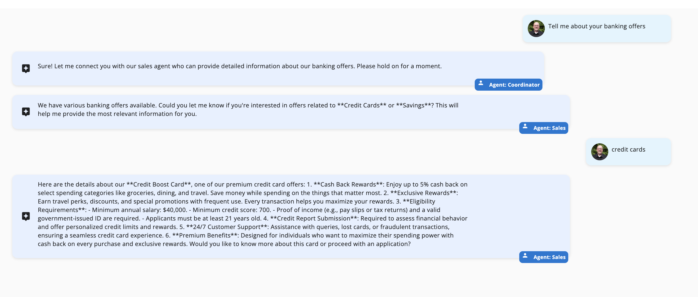
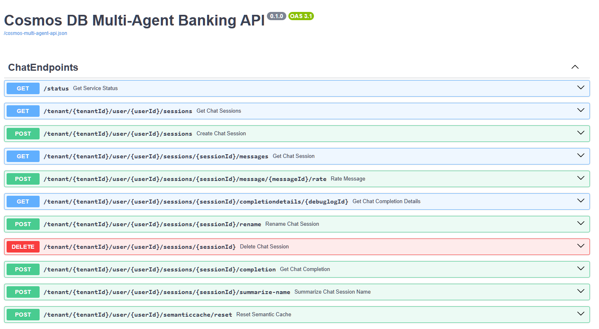
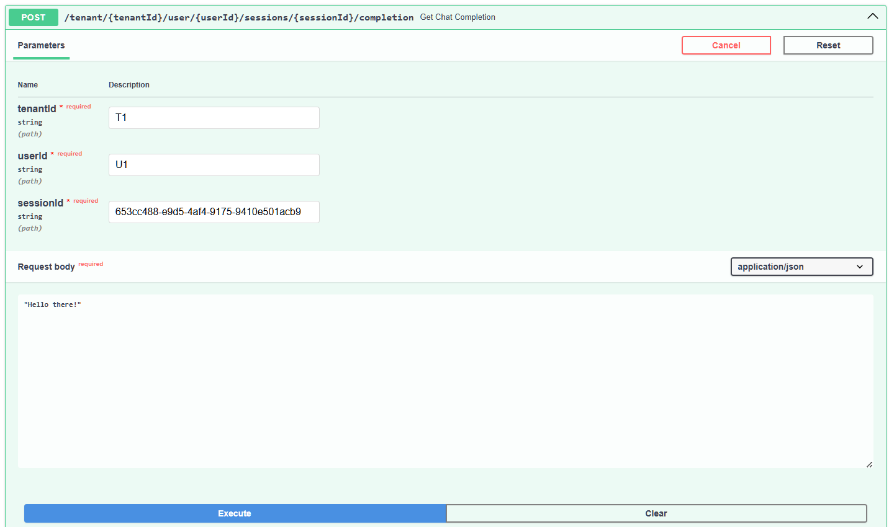

# Lab 3 - Multi-Agent Banking Application

> Make sure you have completed [part 1](part1.md) and have the environment set up.

## Start the agent service

First, install dependencies. For Linux or macOS, use the following commands:

```bash
cd backend

python -m venv .venv
source .venv/bin/activate

pip install -r src/app/requirements.txt
```

For Windows, use the following commands:

```bash
cd backend

python -m venv .venv
.venv\Scripts\activate

pip install -r src/app/requirements.txt
```

> If you are using PowerShell, activate the virtual environment with `.venv\Scripts\Activate.ps1`

Start the FastAPI service:

```bash
uvicorn src.app.banking_agents_api:app --host 0.0.0.0 --port 63280
```

You should see output similar to the following:

```text
INFO:     Started server process [69449]
INFO:     Waiting for application startup.
INFO:     Application startup complete.
INFO:     Uvicorn running on http://0.0.0.0:63280 (Press CTRL+C to quit)
```

## Start the web application

In a new terminal, navigate to the `/frontend` folder, and install dependencies:

```bash
cd frontend
npm install
```

Start the web app:

```bash
ng serve --proxy-config proxy.conf.json
```

Open a browser and navigate to `http://localhost:4200` to view the frontend.

You should be able to create a chat session, send messages, and receive completions from the agents.



## Start a conversation

Each agent is equipped with the ability to delegate tasks and transfer control to other relevant agents when needed.

In your browser, create a new conversation and try transferring money.

1. Type the following text:

```text
I want to transfer money
```

1. When prompted provide the amount and the accounts to transfer from and to.

```text
I want to transfer 500 from Acc001 to Acc003
```

1. When prompted, confirm the transaction (enter `Yes`).
1. The conversation should look similar to this.



Navigate to the Azure Portal, and open the Azure Cosmos DB account. Open the `AccountsData` container and verify the transaction was successful.

Let's test a new scenario that will invoke a vector search for banking offers.

Return to the frontend in your browser and create a new conversation.

1. Type the following text to enquire about banking offers:

```text
Tell me about your banking offers
```

1. When transferred to the sales agent (which handles queries about product information) it will respond with a range of offers to choose from.

2. Type the following text:

```text
credit card
```

The conversation should look similar to this.



## Bonus Activity: Test with Swagger

This solution is built as a backend that exposes API's called by the frontend. With the API layer ready, let's explore simple testing against our API layer in our application.

Open a new browser tab and navigate to <http://localhost:63280/docs> to view the swagger UI.



This app comes with a few pre-created tenant and user ids that you can use to test with.

| Tenant Id | User Id  |
|-----------|----------|
| Contoso   | Mark     |
| Contoso   | Sandeep  |
| Contoso   | Theo     |
| Fabrikam  | Sajee    |
| Fabrikam  | Abhishek |
| Fabrikam  | David    |

We will demonstrate this doing manual testing using the Swagger UI with these operations below. To automate this, you'd take the URIs you see in Swagger and write REST API calls using a testing tool.

Create a new session with tenantId = `Contoso` and userId = `Mark`


Click Execute.

Capture the value of the new sessionId

```json
{
  "id": "653cc488-e9d5-4af4-9175-9410e501acb9",
  "type": "session",
  "sessionId": "653cc488-e9d5-4af4-9175-9410e501acb9",
  "tenantId": "Contoso",
  "userId": "Mark",
  "tokensUsed": 0,
  "name": "Mark Brown",
  "messages": []
}
```

Next use the tenantId, userId, and the sessionId created above to say "Hello there!" to our agents.



Fill in the values and click execute.

Here you can see the request from Swagger and the response from our agent.

```json
[
  {
    "id": "1a568dff-43fe-4477-977b-9c21c8bf61f3",
    "type": "ai_response",
    "sessionId": "653cc488-e9d5-4af4-9175-9410e501acb9",
    "tenantId": "Contoso",
    "userId": "Mark",
    "timeStamp": "",
    "sender": "User",
    "senderRole": "User",
    "text": "Hello there!",
    "debugLogId": "a7203518-51d3-4df8-aa43-7c041b553776",
    "tokensUsed": 0,
    "rating": true,
    "completionPromptId": ""
  },
  {
    "id": "10c6daa8-714d-41d8-b564-99a6c8ffdb5d",
    "type": "ai_response",
    "sessionId": "653cc488-e9d5-4af4-9175-9410e501acb9",
    "tenantId": "Contoso",
    "userId": "Mark",
    "timeStamp": "",
    "sender": "Coordinator",
    "senderRole": "Assistant",
    "text": "Hi there! Welcome to our bank. How can I assist you today? Are you looking for help with general inquiries, opening a new account or loan, or managing transactions? Let me know!",
    "debugLogId": "a7203518-51d3-4df8-aa43-7c041b553776",
    "tokensUsed": 265,
    "rating": true,
    "completionPromptId": ""
  }
]
```
