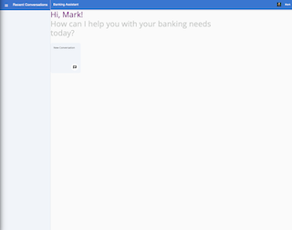
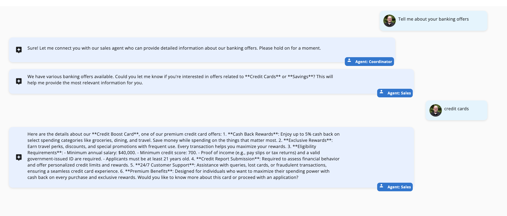
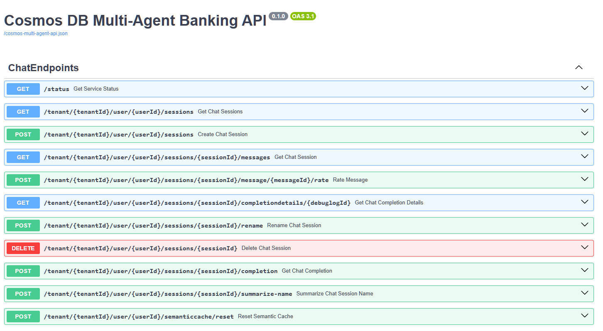

# Challenge 00 - Prerequisites - Ready, Set, GO!

**[Home](../README.md)** - [Next Challenge >](./Challenge-01.md)

## Introduction

Thank you for participating in this Cosmos DB training. Before you can hack, you will need to set up some prerequisites.


## Description

In this challenge, we need to set up your development environment and Azure subscription to ensure you have all the necessary tools and access for the upcoming challenges.


Your coach will provide you with a Resources.zip file that contains the sample banking application and infrastructure templates you'll need for this hack. Save this to your local machine and extract it to a working directory.

Before you can start working on the challenges, you need to make sure you have the right prerequisites in place. This includes:
- [Access Azure Subscription](#access-azure-subscription)
- [Setup Development Environment](#setup-development-environment)
  - [Use GitHub Codespaces](#use-github-codespaces)
  - [Use Local Workstation](#use-local-workstation)
- [Setup Banking Application](#setup-banking-application)
  - [Deploy Azure Resources](#deploy-azure-resources)
  - [Setup App Backend and Frontend](#setup-app-backend-and-frontend)
    - [Setup App Backend](#setup-app-backend)
    - [Setup App Frontend](#setup-app-frontend)

### Access Azure Subscription 
You will need an Azure subscription to complete this hack. If you don't have one, get a free trial here...
- [Azure Subscription](https://azure.microsoft.com/en-us/free/)

### Setup Development Environment 

You will need a set of developer tools to work with the sample application for this hack. 

You can use GitHub Codespaces where we have a pre-configured development environment set up and ready to go for you, or you can setup the developer tools on your local workstation.

A GitHub Codespace is a development environment that is hosted in the cloud that you access via a browser. All of the pre-requisite developer tools for this hack are pre-installed and available in the codespace.

- [Use GitHub Codespaces](#use-github-codespaces)
- [Use Local Workstation](#use-local-workstation)

**NOTE:** We highly recommend using GitHub Codespaces to make it easier to complete this hack.

#### Use Github Codespaces

[](https://codespaces.new/perktime/partner-training-content) <BR>
You must have a GitHub account to use GitHub Codespaces. If you do not have a GitHub account, you can [Sign Up Here](https://github.com/signup).

GitHub Codespaces is available for developers in every organization. All personal GitHub.com accounts include a monthly quota of free usage each month. GitHub will provide users in the Free plan 120 core hours, or 60 hours of run time on a 2 core codespace, plus 15 GB of storage each month.

Please open this link and sign in with your personal Github account. 
**NOTE:** Make sure you do not sign in with your enterprise managed Github account.

You can see your balance of available codespace hours on the [GitHub billing page](https://github.com/settings/billing/summary).

The GitHub Codespace for this hack will host the developer tools, sample application code, configuration files, and other data files needed for this hack. Here are the steps you will need to follow:

Your Codespace environment should load in a new browser tab. It will take approximately 3-5 minutes the first time you create the codespace for it to load.

- When the codespace completes loading, you should find an instance of Visual Studio Code running in your browser with the files needed for this hackathon.

Your developer environment is ready, hooray! Skip to section: [Deploy Azure Resources](#deploy-azure-resources)

**NOTE:** If you close your Codespace window, or need to return to it later, you can go to [GitHub Codespaces](https://github.com/codespaces) and you should find your existing Codespaces listed with a link to re-launch it.

**NOTE:** GitHub Codespaces time out after 20 minutes if you are not actively interacting with it in the browser. If your codespace times out, you can restart it and the developer environment and its files will return with its state intact within seconds. If you want to have a better experience, you can also update the default timeout value in your personal setting page on Github. Refer to this page for instructions: [Default-Timeout-Period](https://docs.github.com/en/codespaces/setting-your-user-preferences/setting-your-timeout-period-for-github-codespaces#setting-your-default-timeout-period) 

**NOTE:** Codespaces expire after 30 days unless you extend the expiration date. When a Codespace expires, the state of all files in it will be lost.

#### Use Local Workstation

**NOTE:** You can skip this section and continue on to "Setup Banking Application" if are using GitHub Codespaces!

If you want to setup your environment on your local workstation, expand the section below and follow the requirements listed. 

<details markdown=1>
<summary markdown="span">Click to expand/collapse Local Workstation Requirements</summary>
  
#### Student Resources

The sample application code, Azure deployment scripts, and sample data sources for this hack are available in a Student Resources package.

You will need to install these on your local workstation:

- [Git](https://git-scm.com/downloads)
  - [Azure Developer CLI (azd)](https://aka.ms/install-azd)
  - [Python 3.12+](https://www.python.org/downloads/)
  - [Node.js](https://nodejs.org/en/download/)
  - [Angular CLI](https://angular.dev/installation#install-angular-cli)
  - [VS Code](https://code.visualstudio.com/Download) with [Python Extension](https://marketplace.visualstudio.com/items?itemName=ms-python.python)

- Download and unpack the Resources.zip you got from your coach to your local workstation.

The rest of the challenges will refer to the relative paths inside the `Resources.zip` file where you can find the various resources to complete the challenges.

##### Setup GitHub Copilot

For parts of this hack we will be relying heavily on GitHub Copilot for coding. Please setup [VS Code with GitHub Copilot](https://code.visualstudio.com/docs/copilot/setup-simplified?wt.md_id=AZ-MVP-5004796)

</details>

### Setup Banking Application
You need to deploy a multi-agent banking application that uses Azure Cosmos DB as its data foundation. This application demonstrates real-world patterns for using Cosmos DB with AI services.

The deployment will create:
- Azure Cosmos DB account with multiple containers
- Azure OpenAI service with required models
- User-assigned managed identity with proper RBAC permissions
- Pre-seeded sample data for the banking application

**NOTE:** All resources will be automatically configured with proper security settings and RBAC permissions. This includes a managed identity that will have access to both Cosmos DB and Azure OpenAI services.
## Deploy Azure Services

Log in with your Azure credentials using the Azure Developer CLI (`azd`):

   ```shell
   azd auth login
   ```

Deploy the Azure services using `azd up`:

   ```shell
   azd up
   ```

When prompted for the environment name, enter: `workshop`.

Use the default selections for the Azure subscription and region.

## Start the agent service

First, install dependencies. If you are using GitHub Codespaces:

```bash
cd Student/Resources/banking-workshop/backend

python -m venv .venv
source .venv/bin/activate

pip install -r src/app/requirements.txt
```
<details markdown=1>
<summary markdown="span">Click to expand/collapse Local Workstation instructions to start the agent service </summary>

```bash
cd Student/Resources/banking-workshop/backend

python -m venv .venv
source .venv/bin/activate

pip install -r src/app/requirements.txt
```

For Windows, use the following commands:

```bash
cd Student/Resources/banking-workshop/backend

python -m venv .venv
.venv\Scripts\activate

pip install -r src/app/requirements.txt
```

> If you are using PowerShell, activate the virtual environment with `.venv\Scripts\Activate.ps1`
</details>
Start the FastAPI service:

```bash
uvicorn src.app.banking_agents_api:app --host 0.0.0.0 --port 63280
```

You should see output similar to the following:

```text
INFO:     Started server process [69449]
INFO:     Waiting for application startup.
INFO:     Application startup complete.
INFO:     Uvicorn running on http://0.0.0.0:63280 (Press CTRL+C to quit)
```

## Start the web application

In a new terminal, navigate to the `/frontend` folder, and install dependencies:

```bash
cd Student/Resources/banking-workshop/frontend
npm install
```

Start the web app:

```bash
ng serve --proxy-config proxy.conf.json
```

Open a browser and navigate to `http://localhost:4200` to view the frontend.

You should be able to create a chat session, send messages, and receive completions from the agents.



## Start a conversation

Each agent is equipped with the ability to delegate tasks and transfer control to other relevant agents when needed.

In your browser, create a new conversation and try transferring money.

1. Type the following text:

```text
I want to transfer money
```

1. When prompted provide the amount and the accounts to transfer from and to.

```text
I want to transfer 500 from Acc001 to Acc003
```

1. When prompted, confirm the transaction (enter `Yes`).
1. The conversation should look similar to this.


Navigate to the Azure Portal, and open the Azure Cosmos DB account. Open the `AccountsData` container and verify the transaction was successful.

Let's test a new scenario that will invoke a vector search for banking offers.

Return to the frontend in your browser and create a new conversation.

1. Type the following text to enquire about banking offers:

```text
Tell me about your banking offers
```

1. When transferred to the sales agent (which handles queries about product information) it will respond with a range of offers to choose from.

2. Type the following text:

```text
credit card
```

The conversation should look similar to this.



## Bonus Activity: Test with Swagger

This solution is built as a backend that exposes API's called by the frontend. With the API layer ready, let's explore simple testing against our API layer in our application.

Open a new browser tab and navigate to <http://localhost:63280/docs> to view the swagger UI.



This app comes with a few pre-created tenant and user ids that you can use to test with.

| Tenant Id | User Id  |
|-----------|----------|
| Contoso   | Mark     |
| Contoso   | Sandeep  |
| Contoso   | Theo     |
| Fabrikam  | Sajee    |
| Fabrikam  | Abhishek |
| Fabrikam  | David    |

We will demonstrate this doing manual testing using the Swagger UI with these operations below. To automate this, you'd take the URIs you see in Swagger and write REST API calls using a testing tool.

Create a new session with tenantId = `Contoso` and userId = `Mark`


Click Execute.

Capture the value of the new sessionId

```json
{
  "id": "653cc488-e9d5-4af4-9175-9410e501acb9",
  "type": "session",
  "sessionId": "653cc488-e9d5-4af4-9175-9410e501acb9",
  "tenantId": "Contoso",
  "userId": "Mark",
  "tokensUsed": 0,
  "name": "Mark Brown",
  "messages": []
}
```

Next use the tenantId, userId, and the sessionId created above to say "Hello there!" to our agents.


Fill in the values and click execute.

Here you can see the request from Swagger and the response from our agent.

```json
[
  {
    "id": "1a568dff-43fe-4477-977b-9c21c8bf61f3",
    "type": "ai_response",
    "sessionId": "653cc488-e9d5-4af4-9175-9410e501acb9",
    "tenantId": "Contoso",
    "userId": "Mark",
    "timeStamp": "",
    "sender": "User",
    "senderRole": "User",
    "text": "Hello there!",
    "debugLogId": "a7203518-51d3-4df8-aa43-7c041b553776",
    "tokensUsed": 0,
    "rating": true,
    "completionPromptId": ""
  },
  {
    "id": "10c6daa8-714d-41d8-b564-99a6c8ffdb5d",
    "type": "ai_response",
    "sessionId": "653cc488-e9d5-4af4-9175-9410e501acb9",
    "tenantId": "Contoso",
    "userId": "Mark",
    "timeStamp": "",
    "sender": "Coordinator",
    "senderRole": "Assistant",
    "text": "Hi there! Welcome to our bank. How can I assist you today? Are you looking for help with general inquiries, opening a new account or loan, or managing transactions? Let me know!",
    "debugLogId": "a7203518-51d3-4df8-aa43-7c041b553776",
    "tokensUsed": 265,
    "rating": true,
    "completionPromptId": ""
  }
]
```
## Success Criteria

To complete this challenge successfully, you should:

- Have an Azure subscription with **Owner** level access
- Have access to Azure OpenAI service (approved application)
- Have verified Azure OpenAI quota availability:
  - GPT-4o: 30K tokens per minute minimum
  - text-embedding-3-small: 5K tokens per minute minimum
- If you decided to install locally rather than use GitHub Codespaces, make sure you have installed all required development tools:
  - [Git](https://git-scm.com/downloads)
  - [Azure Developer CLI (azd)](https://aka.ms/install-azd)
  - [Python 3.12+](https://www.python.org/downloads/)
  - [Node.js](https://nodejs.org/en/download/)
  - [Angular CLI](https://angular.dev/installation#install-angular-cli)
  - [VS Code](https://code.visualstudio.com/Download) with [Python Extension](https://marketplace.visualstudio.com/items?itemName=ms-python.python)
- Have extracted the Resources.zip file provided by your coach
- Can successfully run `azd version` and see output
- Can successfully run `az login` and authenticate to Azure
- Can list your Azure subscriptions using `az account list`

## Learning Resources

- [Request Access to Azure OpenAI Service](https://aka.ms/oaiapply)
- [Manage Azure OpenAI Service Quota](https://learn.microsoft.com/azure/ai-services/openai/how-to/quota)
- [Azure Subscription Permission Requirements](https://learn.microsoft.com/azure/role-based-access-control/built-in-roles/privileged#owner)
- [Azure Developer CLI Installation](https://aka.ms/install-azd)

## Tips

- If you don't have Git installed, you can download the Resources.zip file directly instead of cloning repositories
- Make sure to check your Azure OpenAI quota limits before starting the challenges
- The Azure Developer CLI (azd) is crucial for this hack - it automates infrastructure deployment and application lifecycle management
- Consider using VS Code with the Azure extensions for the best development experience

## Advanced Challenges (Optional)

- Set up GitHub Codespaces or Azure DevBox for a cloud-based development environment
- Configure Azure CLI with multiple subscription contexts
- Set up Azure PowerShell as an alternative to Azure CLI

**[Home](../README.md)** - [Next Challenge >](./Challenge-01.md)